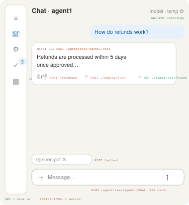
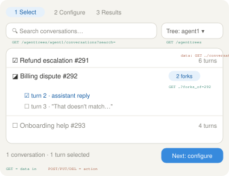
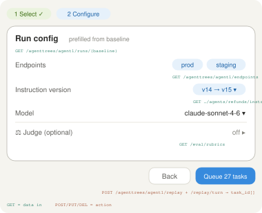
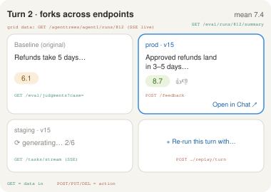
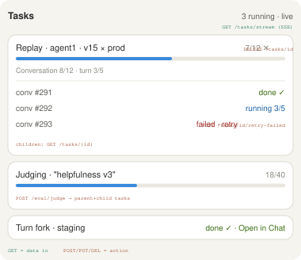
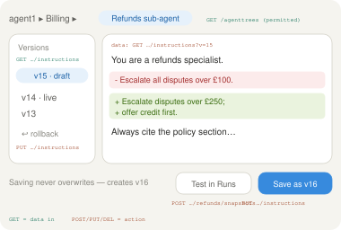
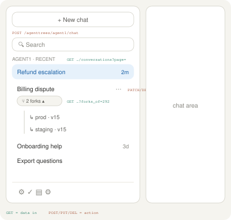
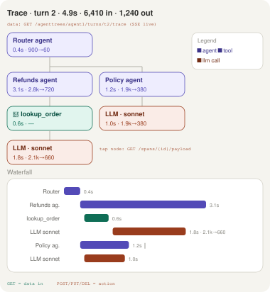
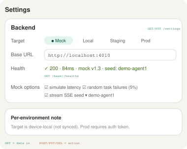
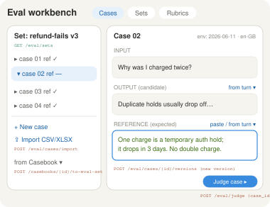

# Chat App — Feature Spec (brief)

## Layout
- Collapsible left sidebar. Two doors: **Chat** and **Evaluate** (a group holding Evaluations / Eval workbench / Casebooks), plus **Settings**. Task-queue badge in sidebar.
- **Expanded sidebar shows recent conversations** under Chat: title + relative time, search, infinite scroll. Forked conversations nest under their parent as a collapsed "N forks" chip (expand to list; lineage badge on each). New chat button at top. Collapsed sidebar = icons only.
- Conversation actions (long-press/⋯): rename, delete, open parent (if fork), send to Evaluations.
- Chat has its own **Settings submenu** (model, temperature, system prompt — session-scoped).

## Chat window
- Message list with streaming assistant responses (markdown + code blocks).
- **Per assistant turn**: 👍 / 👎 / copy buttons (feedback POSTed with message id).
- **Composer**: text input + **+ button** → attach images and files (attachment chips, removable before send). Enter = send, Shift+Enter = newline.
- Auto-scroll on stream; stop-generation button while streaming.

## Auth (toggleable)
- **`AUTH_MODE=on|off`** — env-injected per deployment; also switchable in Settings → Backend for non-prod targets. Prod forces `on`.
- **Off (dev default)**: no login screen; app boots as a configurable dev user (`DEV_USER=admin|restricted`, default admin = all trees, all rights). `GET /me` still called — the backend/mock just answers with the dev user, so permission code paths run identically and no component ever branches on auth mode.
- **On**: login screen (email + password or SSO redirect) → `POST /auth/token`; token attached by the single API client; 401 anywhere → back to login. Session shown in Settings with sign-out.
- **Admin UI** (visible when `/me` grants admin): Settings → Members — user list, per-tree permission matrix (view/tune/evaluate checkboxes), invite by email. API: `GET/PUT /admin/users`, `GET/PUT /admin/users/{id}/permissions`.
- **Admin → Agent trees**: list all trees with an **enable/disable toggle** per tree (`PATCH /admin/agenttrees/{id}` `{enabled}`). Disabled tree: hidden from `GET /agenttrees` for non-admins (admins see it greyed with a "disabled" badge); new chat/replay/judge against it return `409 tree_disabled`; queued tasks on it are cancelled; existing conversations stay **readable** (read-only banner) so history and traces aren't lost. Re-enabling restores everything.
- Mock server serves both modes (`AUTH_MODE` env): off = dev users; on = seeded credentials (`admin@demo` / `restricted@demo`) issuing real-shaped JWTs, so the auth-on path is testable without a real IdP.

## Agent tree view (structure visualization)
- Each tree's **home view is a static node-and-edge diagram** of the agent hierarchy (root → sub-agents), reusing the trace view's node components (same colors/shapes; no timings — this is structure, not execution).
- Node shows: agent name, live instruction version, tools attached (icons), enabled state. Disabled/unpermitted styling per tree rules.
- **Node click → instruction editor** for that agent (breadcrumb stays in sync). Node context (⋯): Test as evaluation, view recent conversations for this agent, add sub-agent (opens New-agent wizard pre-placed).
- Layout: auto (top-down dagre-style), pan/zoom for large trees; collapsible subtrees.
- Data: `GET /agenttrees/{tree}/agents` (returns hierarchy + version + tools per agent).

## Agent trees & permissions
- Agents are organised in **trees**; multiple trees per deployment.
- Permissions per tree (`view` / `tune` / `evaluate`). `GET /agent-trees` returns only permitted trees; unpermitted trees never render.
- Instruction editing is **versioned**: save = new version, never overwrite. Diff view + rollback.
- **Instruction format per agent**: `format: text | yaml` (agent metadata). YAML mode: syntax highlighting + **schema validation in the editor** — Phase 2 ships the **Google ADK agent-config schema**; a failing edit blocks save with inline errors, so bad config dies in the editor, not at runtime. The validation layer is schema-pluggable by design, but additional frameworks (CrewAI, LangGraph, …) are **Phase 4 scope** — do not build their schemas earlier.
- **Model precedence rule**: Run Config's model override beats the YAML's `model:` key **for that run only** (grid column labeled with the override). The YAML remains the sole source of truth for live traffic; permanently changing the model = editing `model:` → new version → (optionally) PR → promote.

---

## Evaluations workspace

One engine: *take stored conversations **or individual turns**, re-execute them under a changed config, optionally judge them, queue the work, compare outputs.* One page, one flow — there is no second, differently-configured entry into it.

### Flow — 3-step stepper
1. **Select** — ConversationPicker: search/filter/multi-select conversations, **expandable to pick individual turns** within a conversation (checkbox per turn). Scoped by permissions.
2. **Configure** — Run Config drawer (right side), prefilled from the baseline so changing one axis = one field:
   - Agent tree + instruction version
   - Model, temperature
   - **Judge (optional, collapsed by default)**: toggle on → judge model + rubric fields appear
3. **Results** — Comparison grid: baseline column + one column per run config, row per turn. Diff highlighting. Per-cell 👍/👎 always available. If judge on: score column + summary header (mean, distribution sparkline), drill-in per turn for judge reasoning.

### Evaluation domain (first-class, judge optional)
Evaluation is its own domain, not a bolt-on to runs:

- **EvalCase** = `{input, output, reference?}`
  - `input`: prompt + context (frozen)
  - `output`: candidate response (from a run, a fork, or pasted)
  - `reference`: expected answer — **handcrafted** in an editor, or **sourced from conversation history** (pick a turn → its response becomes the reference). Nullable (reference-free rubrics allowed).
- **EvalSet**: named collection of cases (versioned, reusable across runs/models).
- **Judgment** (persisted forever, never overwritten): `{subject: {kind, id}, scorer: {kind, ref, version, model}, evaluation_id?, score, reasoning, created_at}`. Re-judging appends a new judgment; history per case is queryable, so scores are comparable across time/judges/rubrics.
- Judge off: pure replay, manual eyeball + thumbs (thumbs also persist as lightweight judgments, `scorer: human`).
- **"Judge this evaluation"** on any finished run: maps its outputs onto eval cases (auto-creating cases from conversation turns if none exist) and enqueues judging.
- Results grid: score column reads latest judgment per (case, rubric); history popover shows prior judgments.
- **Eval workbench** (its own entry under **Evaluate** in the sidebar): manage the eval domain directly — case editor (input / output / reference fields; "reference from turn" picker), set manager (create/name/version sets, drag cases in), rubric editor (prompt text, save = new version, test against one case). Entry also from any turn: "add as eval case". **Bulk import**: upload CSV/XLSX (or paste a table) with columns mapped to input/output/reference → creates/extends a set in one shot (`POST /eval/cases/import`, queued for large files; row errors reported per line, not all-or-nothing).
- **Seeing results**: scores stream into the grid live as judging tasks finish (SSE), color-banded badges; summary header (mean + distribution) updates live. Tap a badge → **judgment drawer**: score, judge reasoning, rubric+version, judge model, input/output/reference side by side, and append-only history below. Conversation drill-in shows per-turn score chips with inline reasoning. Grid sortable/filterable by score (triage worst-first → re-run from the cell). Finished judging task in queue panel links "View results" to the sorted grid.

### Turn-level re-fire → forked conversations
- Re-firing a turn targets **one or many endpoints** (endpoint = an agent deployment/backend target; multi-select in Run Config alongside model/instructions).
- Each (turn × endpoint × config) **forks a new conversation**: original history up to that turn is copied, the turn is re-generated by the chosen endpoint, and the result is stored as a normal conversation.
- Forks carry **lineage metadata**: parent conversation id, fork turn, endpoint + config used. Shown as a badge/breadcrumb.
- **Open in Chat**: any fork can be opened in the main Chat page and continued there like any conversation (composer, attachments, thumbs all work). "Open in Chat" button on every results cell and in RunsList.
- Endpoint: `POST /replay/turn` body includes `endpoints: []`; returns one `task_id` + new `conversation_id` per endpoint.
- Entry points: turn checkboxes in Select step, "re-run this turn with…" on any results cell, and 🔀 fork action on any turn in Chat itself.
- Forked conversations appear in `GET /conversations` (filterable: `forks_of={id}`), and the comparison grid can pivot to **compare forks of the same turn across endpoints** (column per endpoint).

### Context envelope & replay fidelity
- **Every turn captures an envelope at generation**: `{system_date, timezone, region, locale, user_profile_ref?}`. Stored on the turn, shown in trace header and Inspector metadata. Mock/generator produce varied envelopes (users in different regions/dates) so this is exercised from day one.
- **Run Config → Context policy**: `frozen` (default — replay under each turn's original envelope) · `current` (today's context, for time-drift testing) · `custom` (explicit values). Comparison grid labels each column's policy; mixed-policy comparisons get a warning badge.
- **Fallback envelope** ("when context is unclear, use X"): a settings-level default envelope applied to turns that have none (legacy/imported). Applied explicitly — the grid marks such cells `env: fallback`, never silently "now".
- **Tools mode**: `playback` (replay tool spans' recorded results from the original trace — true counterfactual: only instructions/model/endpoint vary) · `live` (re-execute tools). Playback is the default under `frozen`; a tool absent from the trace falls back per-call to live or mock (logged in the new trace).
- **Judging**: the judge prompt receives the case's envelope; relative references ("today", "here") resolve against it, not against judgment time.
- API: envelope on turn objects in `GET …/conversations`; `POST …/replay(/turn)` accepts `{context_policy, context_override?, tools_mode}`; fallback envelope in `GET/PUT /settings`.
- Phasing: envelope capture + frozen default = **Phase 1** (data gap is unfixable later); policy UI, fallback setting, tool playback = **Phase 2**.

### Test as evaluation (from the instruction editor)
- Opens Evaluations at Step 2 with config prefilled: edited agent + open version, baseline = live version.
- **Draft snapshot rule (decided)**: drafts are testable without saving. On "Test as evaluation" the draft text is **snapshotted immutably** into the run config (`snapshot_id`), so the tested text is exactly what ran even if editing continues. On save, the snapshot is promoted to the next version (e.g. v16) and all runs referencing that `snapshot_id` **relabel** to v16. Unsaved snapshots display as "v15-draft (a3f2)".
- **Last-used selection (decided)**: the previous conversation set is remembered **per agent** (`GET/PUT /agents/{id}/last-selection`). Repeat testing = Test as evaluation → Queue, two taps. First-time testing drops into Select, pre-filtered to conversations that used this agent (toggle to widen).
- Results include "Back to editor" breadcrumb: edit → test → tweak → save loop. Traces (⌁) on replayed turns let you compare where the draft changed behaviour.
- API: `POST /agents/{id}/snapshots` (immutable draft snapshot → `snapshot_id`), snapshot promotion on `PUT /agents/{id}/instructions`, `GET/PUT /agents/{id}/last-selection`.

### Agent authoring fast path (AI-assisted, repo-backed)
The shortest path from intent to shipped agent: **describe → AI drafts → test → PR**.

- **"New agent" from anywhere** (sidebar +, tree view): plain-language prompt ("a refunds agent that escalates over £250") → AI backend drafts the instructions, suggests placement in the tree and tools to attach → lands in the editor as a v1 draft. One screen, no blank page.
- **AI assist inside the editor**: a copilot panel wired to the configured LLM. Actions: draft, refine ("stricter on disputes"), critique against best practices, and **generate eval cases + a rubric from the instructions themselves** — so a new agent is born with its test set. Suggestions arrive as diff hunks (accept/reject per hunk), reusing the editor's diff view; accepted hunks are just edits to the draft (normal snapshot/version rules apply).
- **Test**: Test as evaluation as specced; if the agent has no conversation history yet, the generator synthesizes seed conversations for it (drip scoped to one agent), and the AI-generated eval set gives the judge something to score. New agents are testable at minute one.
- **Check into repo (agents-as-code)**: instructions live as files (`agents/{tree}/{agent}/instructions.md` + `meta.yaml`). Settings → Repo connects GitHub (App or token: repo, path, base branch). Editor gains **"Open PR"**: pushes the version as a branch + PR with the instruction diff as the PR diff; PR link shown on the version. **Merge = promote**: webhook receives the merge and marks that version live in the app; editing in the app and editing in the repo converge on the same files. Config chooses source of truth: `repo` (app is a UI over git) or `app` (git is export + review trail).
- API: `POST /assist` (`{action: draft|refine|critique|gen_evals, agent?, prompt}` → queued task, streams), `POST /agenttrees/{tree}/agents/{id}/pr` (`{version}` → PR url), `GET/PUT /settings/repo`, `POST /webhooks/git` (merge events).
- E2E: 13. Authoring: new agent from prompt → draft appears → accept a refine hunk → gen evals → Test as evaluation → Open PR (against mock git) → merge webhook promotes.

### Task queue (global, live progress)
- All backend work enqueued; every request returns `task_id`.
- **Task model**: `{id, type, status, progress: {done, total, stage}, parent_id?, error?, created/started/finished_at}`. Batch work (replay of N conversations, judging of N cases) = parent task + child task per unit, so progress = children completed.
- **Live updates via SSE** (`GET /tasks/stream`): status changes and progress events push as they happen — no refresh. Fallback: polling `GET /tasks`.
- Progress granularity: replays report per conversation → per turn ("Conversation 3/10 · turn 2/6"); judging reports per case; long generations stream a "generating…" stage. Stage label shown next to the bar.
- **Queue panel** (all pages): each task shows live progress bar + stage text + elapsed time; expandable to child tasks; cancel (parent cancels children). Failed children don't kill the batch — shown as partial failure with retry-failed button.
- Sidebar badge: pending count; subtle spinner while anything is running.
- Results appear **incrementally**: as each child task finishes, its cell/row populates in the comparison grid (no waiting for the whole batch).

## API
Tree-scoped: conversation/run/chat resources live under `/agenttrees/{tree_id}/…` (e.g. `agent1`) — permission checks fall out of the path. Global: tasks, span payloads, eval rubrics/judgments, settings.

- Inspector/Casebooks: `GET /admin/conversations` (cross-user), `GET/POST/PATCH/DELETE /casebooks`, `POST/DELETE /casebooks/{id}/items`, `POST /casebooks/{id}/to-eval-set`, `POST /casebooks/{id}/replay`
- Memory: `GET/PUT/DELETE /agenttrees/{tree}/memory`, `POST /agenttrees/{tree}/memory/compact` (queued); `/chat` accepts `memory` flag
- Assist: `POST /assist` (draft/refine/critique/gen_evals → queued, streams); Repo: `POST /agenttrees/{tree}/agents/{id}/pr`, `GET/PUT /settings/repo`, `POST /webhooks/git`
- Identity: `GET /me` (user + per-tree permissions; answers in both auth modes), `POST /auth/token`, `POST /auth/logout`; Admin: `GET/PUT /admin/users`, `GET/PUT /admin/users/{id}/permissions`
- Trees: `GET /agenttrees` (permitted + enabled; admins also see disabled), `GET /agenttrees/{tree}/endpoints` (deploy targets for replay); Admin: `PATCH /admin/agenttrees/{id}` (`{enabled}`)
- Meta: `GET /models` (chat/run/judge model dropdowns), `GET /healthz` (backend switcher); Generator: `POST /admin/generator` (`{mode: seed|drip|stop, seed?, rates?}`), `GET /admin/generator/status`
- Chat: `POST /agenttrees/{tree}/chat` (SSE; queued → returns task_id), stop = `DELETE /tasks/{task_id}`, `POST /feedback` (writes a `scorer: human` judgment — single store with /eval/judgments), `POST /upload`, `GET/PUT /settings`
- Agents: `GET /agenttrees/{tree}/agents`, `GET/PUT /agenttrees/{tree}/agents/{id}/instructions` (versioned; carries `format`, YAML saves validated server-side too), `POST /agenttrees/{tree}/agents/{id}/snapshots` (immutable drafts), `GET/PUT /agenttrees/{tree}/agents/{id}/last-selection`
- Conversations: `GET /agenttrees/{tree}/conversations` (paginated, `?search=`, `?forks_of={id}`, sorted by last activity; incl. turns; lineage on forks), `PATCH`/`DELETE /agenttrees/{tree}/conversations/{id}`
- Runs: `POST /agenttrees/{tree}/replay`, `POST /agenttrees/{tree}/replay/turn` (`endpoints[]` → task + conversation per endpoint), `GET /agenttrees/{tree}/runs`, `GET /agenttrees/{tree}/runs/{id}`
- Trace: `GET /agenttrees/{tree}/turns/{turn_id}/trace`, `GET /spans/{id}/payload`
- **Evaluation domain** (global; cases reference tree-scoped sources):
  - Import: `POST /eval/cases/import` (CSV/XLSX/pasted table, column mapping, per-row error report)
  - Cases: `POST /eval/cases` (handcrafted or `source: {tree, conversation_id, turn_id}`), `GET /eval/cases/{id}`, `PUT` (new version)
  - Sets: `POST/GET /eval/sets`, `PUT /eval/sets/{id}` (versioned membership)
  - Rubrics: `GET/POST /eval/rubrics`, `PUT /eval/rubrics/{id}` (save = new version)
  - Judging: `POST /eval/judge` (`{set_id | case_ids | evaluation_id, judge_model, rubric_id}` → enqueued), judgments append-only
  - Scores: `GET /eval/judgments?subject_id=&evaluation_id=&scorer_ref=` (history), `GET /eval/evaluations/{evaluation_id}/summary` (aggregates)
- Queue: `GET /tasks`, `GET /tasks/{id}` (incl. children), **`GET /tasks/stream`** (SSE: status + progress), `DELETE /tasks/{id}` (cancel, cascades), `POST /tasks/{id}/retry-failed`

## Shared components (build once)
`<ConversationPicker/>` (turn-expandable), `<RunConfigPanel/>` (diff-from-baseline, optional judge section), `<ComparisonView/>` (pluggable annotation: thumbs and/or scores), `<TaskQueue/>`, `<RunsList/>`.

---

## Turn trace (observability)

- Every turn records a **trace**: a tree of spans. Span = `{id, parent_id, type: agent|llm|tool, name, start, end, tokens_in?, tokens_out?, cost?, model?, status, payload_ref}`.
- **Entry**: ⌁ trace icon on every turn — in Chat, results grid cells, and drill-in. Works on originals, forks, and replays alike (so you can compare traces across configs).
- **Trace view**, two synced layers:
  - **Call tree**: nodes colored by type (agent / tool / LLM), each badged `time · tokens in→out`. Header shows turn totals (wall time, total tokens in/out, cost).
  - **Waterfall**: one row per span, bars positioned on the turn's timeline — sequence, duration, and parallel branches visible at a glance.
- **Span drawer** (tap node or bar): full prompt/response for LLM spans, args/result for tool spans, model, exact token counts, cost, status/error. Errors mark the span red in both views.
- Traces stream: spans appear live while the turn is generating (same SSE channel as tasks).
- API: `GET /turns/{turn_id}/trace` (span tree), `GET /spans/{id}/payload` (lazy-loaded prompt/response bodies).

---

## Backend targets & mock server

### Settings → Backend (sketch 9)
- **Target switcher**: Mock / Local / Staging / Prod presets + custom **Base URL** field. All API calls go through one configurable client (`{base}` prefix) — no hardcoded hosts anywhere.
- **Health check**: `GET {base}/healthz` on select — shows status, latency, server version, and (for mock) the loaded seed.
- **Mock options** (visible when target = Mock): simulate latency, random task failures (%, for retry-flow testing), SSE streaming on/off, seed dataset picker.
- Target is device-local (not synced via `/settings`); Prod requires an auth token field. Non-prod targets show a colored banner in the app chrome so nobody mistakes mock data for real.

### Mock server requirements (what this app needs)
Not just static JSON — the app's core loops depend on behavior:
1. **Every endpoint in the API section**, tree-scoped under `/agenttrees/agent1` (+ a second seeded tree for permission testing).
2. **SSE**: `POST /agenttrees/{t}/chat` streams tokens; `GET /tasks/stream` pushes parent/child progress events; trace spans stream during generation.
3. **Stateful**: enqueue → progress → done lifecycle with child tasks; snapshots promote to versions on save; forks create real conversations with lineage; judgments append.
4. **Seed data**: produced by the generator's `seed` mode (see Data generator) — 2 trees, agent hierarchy with 3+ instruction versions, ~20 conversations incl. forks, past runs, judgments across 2 rubrics, traces with parallel spans. **Persistent** (SQLite volume), plus `drip` mode for continuous fill.
5. **Failure injection**: configurable % of child tasks fail (exercises retry-failed), configurable latency.

### Mock server choices
| Option | Fit | Verdict |
|---|---|---|
| **MSW** (Mock Service Worker) | In-browser interception; same mocks reuse in unit tests; no process to run | Best for frontend dev; SSE mocking is manual but doable |
| **Tiny FastAPI mock** | Full control: real SSE, task lifecycle simulation, stateful seed | Best fidelity for this app's queue/streaming design; ~300 lines |
| **Prism** (from OpenAPI) | Auto-mock from the API contract; keeps spec honest | Good for contract checks; can't simulate task progression |
| **Mockoon** | GUI, easy sharing, latency/failure rules | Fine for quick demos; weak stateful flows |
| **json-server** | 5-minute REST from JSON | Too static — no SSE, no task lifecycle |

**Recommendation**: MSW for day-to-day frontend dev and tests, plus the small FastAPI mock as the "Mock" target in Settings for full-fidelity demos (SSE, live progress, failures). Author the API as an OpenAPI file so Prism/contract tests come free.

### Data generator (auto-fill mechanism)
The app should never look empty — a generator produces realistic synthetic data, and everything it produces is **persisted like real data**, not conjured per-request.

- **Persistence**: the mock server stores state in SQLite on a mounted volume (survives pod restarts); the real backend persists to its normal Postgres. Same generator code targets either — it writes **through the public API** (`POST …/chat`, `/replay`, `/eval/judge` etc.), never directly to the DB, so generated data exercises the exact same code paths, queues, and SSE streams as real usage.
- **Two modes**:
  - `seed` (one-shot): builds the baseline dataset — trees, agents + versions, ~20 conversations with forks, runs, judgments, traces. Deterministic from `--seed N` (e2e depends on this).
  - `drip` (continuous): background loop that keeps the app alive — every N seconds starts a new conversation, adds turns to open ones, occasionally forks, queues a replay, judges a finished run. Rates configurable (`conversations/hr`, `runs/hr`, `fail %`). Content from persona/topic templates + light LLM generation when a real key is configured, faker-style text otherwise.
- **Control**: `POST /admin/generator` `{mode: seed|drip|stop, seed?, rates?}`, `GET /admin/generator/status` (counts produced, current rates). Surfaced in **Settings → Backend** when target is mock (seed picker becomes "Seed now" + drip toggle with rate sliders) and in **Settings → Admin** for the real backend (staging only — Prod hides it).
- **Visible liveness**: drip-generated activity flows through the normal task queue and SSE — the queue badge ticks, conversations appear in the sidebar, results grids fill. That's the point: the app demos itself.

### Deployment verification (Kubernetes + Playwright e2e)

**Pod layout** — main app ships with its test harness:
- `app`: the Node/React app (serves UI + proxies API client per backend target)
- `mock-server` sidecar: the FastAPI mock (requirements above), listening on `localhost:4010`, seeded at start (`SEED=demo-agent1`)
- On deploy, the app's default backend target is injectable via env (`BACKEND_TARGET=mock|<url>`), so the same image runs against mock or real backends

**E2E fire-on-deploy**:
- A **Playwright Job** triggers automatically after each rollout (Helm `post-install`/`post-upgrade` hook or Argo CD `PostSync`). It targets the app Service with the mock sidecar as backend.
- Job image: `mcr.microsoft.com/playwright` + the e2e suite from the repo (`/e2e`), env: `APP_URL`, `EXPECTED_VERSION`.
- **Gate**: Job failure fails the release (hook `failed` → rollback / block promotion). HTML report + traces uploaded as artifacts.
- Mock determinism: e2e runs with failure-injection ON at fixed seed, so retry-failed and error states are exercised reproducibly.

**E2E coverage checklist** (one spec file per numbered dev prompt; each asserts against the endpoint tags in the sketches):
1. Shell: sidebar collapse, conversation list loads/searches, fork nesting expands
2. Chat: send → SSE tokens render; 👍/👎 posts feedback; copy; attach + upload; stop generation
3. Evaluations: select conversations + single turns → configure (endpoints multi-select, version change highlighted) → queue → results fill incrementally
4. Forks: 🔀 a turn against 2 endpoints → 2 new conversations with lineage → Open in Chat → continue
5. Judge: enable judge → scores stream in → judgment drawer shows reasoning + history; retroactive "Judge this evaluation"
6. Queue: parent/child progress via SSE, cancel cascades, injected failure → retry-failed succeeds
7. Editor: edit draft → Test as evaluation (snapshot) → back → save v16 → run relabels
8. Trace: ⌁ opens tree + waterfall, span drawer lazy-loads payload, totals match seed
9. Backend switcher: swap target, healthz reflects, non-prod banner shows
10. Permissions: second seeded tree hidden for restricted test user
11. Tree disable: admin disables tree 2 → hidden for non-admin, chat against it 409s, its queued tasks cancel, old conversations read-only; re-enable restores
12. Auth: suite runs twice — AUTH_MODE=off (dev user), and AUTH_MODE=on (login with seeded creds, 401 redirect, admin permission matrix edit takes effect)

## UI page × API grid

| UI page / element | APIs called |
|---|---|
| Login (AUTH_MODE=on) | `POST /auth/token`, `GET /me` |
| App shell / sidebar | `GET /me`, `GET /agenttrees`, `GET /tasks` (badge) |
| Sidebar conversation list | `GET /agenttrees/{tree}/conversations` (`?search`, `?page`, `?forks_of`), `PATCH`/`DELETE …/conversations/{id}` |
| Chat window | `POST /agenttrees/{tree}/chat` (SSE, → task_id), stop = `DELETE /tasks/{id}`, `POST /upload`, `POST /feedback`, `GET /models` |
| Chat turn actions | `POST /feedback`, `POST /agenttrees/{tree}/replay/turn` (fork), `GET /agenttrees/{tree}/turns/{id}/trace` |
| Evaluations · 1 Select | `GET /agenttrees/{tree}/conversations` |
| Evaluations · 2 Configure | `GET /agenttrees/{tree}/endpoints`, `GET …/agents/{id}/instructions`, `GET /models`, `GET /eval/rubrics`, `GET …/runs/{baseline}` |
| Evaluations · queue action | `POST /agenttrees/{tree}/replay`, `POST …/replay/turn` |
| Evaluations · 3 Results grid | `GET /agenttrees/{tree}/evaluations/{id}` (+ SSE fill), `GET /eval/judgments`, `GET /eval/evaluations/{id}/summary`, `POST /feedback`, `POST …/replay/turn` (re-run cell) |
| Judgment drawer | `GET /eval/judgments?subject_kind=case&subject_id=`, `GET /eval/cases/{id}` |
| Eval workbench | `POST /eval/cases/import`, `POST/PUT /eval/cases`, `POST/GET/PUT /eval/sets`, `GET/POST/PUT /eval/rubrics`, `POST /eval/judge` |
| Agent tree view | `GET /agenttrees/{tree}/agents` |
| Instruction editor | `GET/PUT /agenttrees/{tree}/agents/{id}/instructions`, `POST …/snapshots`, `GET/PUT …/last-selection` |
| Editor · AI copilot | `POST /assist` (streams via task SSE) |
| Editor · Open PR / Settings · Repo | `POST …/agents/{id}/pr`, `GET/PUT /settings/repo` |
| New agent wizard | `POST /assist` (draft), `PUT …/instructions` (v1) |
| Inspector | `GET /admin/conversations`, `POST /casebooks/{id}/items` |
| Casebook view | `GET /casebooks/{id}`, `POST …/to-eval-set`, `POST …/replay` |
| Memory panel | `GET/PUT/DELETE /agenttrees/{tree}/memory`, `POST …/memory/compact` |
| Trace view | `GET /agenttrees/{tree}/turns/{id}/trace` (SSE live), `GET /spans/{id}/payload` |
| Task queue panel | `GET /tasks`, `GET /tasks/{id}`, `GET /tasks/stream` (SSE), `DELETE /tasks/{id}`, `POST /tasks/{id}/retry-failed` |
| Settings · global | `GET/PUT /settings` |
| Settings · Backend | `GET {base}/healthz` |
| Settings · Members (admin) | `GET/PUT /admin/users`, `GET/PUT /admin/users/{id}/permissions` |
| Settings · Agent trees (admin) | `GET /agenttrees` (incl. disabled), `PATCH /admin/agenttrees/{id}` |
| Settings · Generator (mock/staging) | `POST /admin/generator`, `GET /admin/generator/status` |

---

## UI sketches

| # | Screen | Notes |
|---|---|---|
| 1 |  | Collapsed sidebar (queue badge), per-turn 👍/👎/copy/🔀 fork, composer with + attach |
| 2 |  | Step 1: conversation picker, expandable per-turn checkboxes, fork chips, tree filter |
| 3 |  | Step 2: Run Config drawer — endpoints multi-select, changed fields highlighted, judge collapsed |
| 4 |  | Step 3: comparison grid — baseline + fork columns, scores, incremental fill, re-run cell |
| 5 |  | Global task panel: parent/child progress, stage text, retry-failed, Open in Chat |
| 6 |  | Agent tree breadcrumb, version list with rollback, inline diff, save = new version |
| 7 |  | Expanded sidebar: new chat, search, recent list, forks nested under parent with ↳ lineage |
| 8 |  | Per-turn trace: call tree (agent/tool/LLM nodes with time + tokens), waterfall with parallelism, span drawer |
| 9 |  | Backend target switcher: Mock/Local/Staging/Prod/custom URL, health check, mock options |
| 10 |  | Cases/Sets/Rubrics tabs, case editor (input/output/reference, from-turn pickers, envelope), CSV/XLSX import, Casebook entry |

Two sets: `sketches/` (annotated — every actionable widget carries an inline endpoint tag) and `sketches/clean/` (**dense, annotation-free** versions showing target information density — build to the clean set's density, use the annotated set for API wiring). In the annotated set, every actionable widget carries an inline endpoint tag: teal `GET` = the call that feeds that widget's data, coral `POST/PUT/DELETE` = the call the action fires (`agent1` as the example tree).

---

## Development prompts (one per task)

1. **Shell**: "Build the app shell: collapsible sidebar with Chat/Evaluate/Settings routes, Evaluations + Eval workbench + Casebooks grouped under the one Evaluate door; expanded sidebar shows searchable recent-conversations list (paginated `GET /conversations`), forks nested under parents as expandable 'N forks' chips, new-chat button, ⋯ actions (rename/delete/open parent/send to Evaluations). Cite the component tree before coding."
2. **Chat UI**: "Build the Chat page: message list, SSE streaming from `POST /chat`, markdown rendering. Quote the API contract from the spec first."
3. **Turn actions**: "Add 👍/👎/copy per assistant message; POST `{message_id, rating}` to `/feedback`; copy copies raw markdown."
4. **Composer**: "Build the composer: textarea, + button for file/image picker, removable attachment chips, multipart upload to `/upload` before send. Enforce type/size limits from settings."
5. **Chat settings submenu**: "Settings submenu under Chat (model, temperature, system prompt), session-scoped, sent with each `/chat` call."
6. **Global settings**: "Settings page bound to `GET/PUT /settings`, validation, optimistic save with rollback."
7. **Auth**: "Implement toggleable auth per the Auth section: AUTH_MODE env + Settings toggle (non-prod), no-auth dev user via GET /me (no component branches on mode), login screen + token client + 401 redirect when on, Settings → Members admin matrix. Quote the rule that /me is always called."
7b. **Tree admin**: "Build Settings → Agent trees: admin list with enable/disable toggles via PATCH /admin/agenttrees/{id}; disabled = hidden for non-admins, greyed for admins, 409 on new work, tasks cancelled, conversations read-only with banner. Quote the disabled-tree effects from the Auth section."
7c. **Permissions**: "Wire agent-tree permissions: `GET /agent-trees`, scope all pickers, never render unpermitted trees. Cite the permission rules."
8. **Task queue**: "Global task queue with live progress: parent/child task model, SSE via `GET /tasks/stream` (polling fallback), per-task progress bar + stage text, expandable children, cancel cascades, retry-failed for partial failures, sidebar badge. Comparison grid cells populate incrementally as child tasks finish. Quote the task model and queue API from the spec first."
9. **Shared components**: "Build ConversationPicker (turn-expandable), RunConfigPanel (diff-from-baseline, collapsed judge section), ComparisonView (pluggable annotations), RunsList. No page-specific logic inside."
10. **Agent tree view**: "Build the tree home view: static dagre-layout node diagram from GET /agenttrees/{tree}/agents, reusing trace-view node components (structure only, no timings); node shows name/live version/tools; click opens the instruction editor; ⋯ menu (Test as evaluation, recent conversations, add sub-agent); pan/zoom + collapsible subtrees. Quote the reuse rule — same node components as trace."
10b. **Agent editor**: "Agent-tree picker + versioned instruction editor: save = new version, diff, rollback; format text|yaml per agent, YAML = highlighting + ADK schema validation blocking save with inline errors (schema layer pluggable, but ONLY ADK in Phase 2 — other frameworks are Phase 4); model precedence: Run Config override is per-run only, YAML model: rules live traffic. Never overwrite — cite the rule and the precedence rule."
11a. **Context envelope**: "Capture the envelope on every generated turn (mock+generator produce varied ones), show it in trace header/Inspector, replay frozen-by-default. Phase 2 adds: context policy control in Run Config with grid labels + mixed-policy warning, fallback envelope setting with env:fallback cell marks, tools playback from trace spans with per-call live/mock fallback logged. Quote the capture-at-generation rule first — envelopes are never reconstructed."
11. **Evaluations page**: "Wire the 3-step Evaluations flow with shared components; `POST /replay` for conversations, `POST /replay/turn` for single turns; results in ComparisonView with thumbs."
12a. **Inspector & Casebooks**: "Build the Inspector (virtualized cross-user table + filters as URL params, transcript reader, keyboard nav j/k/a) gated on the inspect role with audit logging, Casebooks as turn-reference collections with ⊞ everywhere, and the three casebook actions (to-eval-set, replay, examples block in editor). Quote the reference-not-copy rule and the keyboard map first."
12. **Eval workbench**: "Build the eval workbench tab (sketch 10): case editor (handcrafted input/output/reference + reference-from-turn picker), set manager (versioned membership), rubric editor (save = new version, test-against-one-case). 'Add as eval case' action on turns; CSV/XLSX/paste bulk import with column mapping and per-row errors via POST /eval/cases/import. Quote the EvalCase model first."
12b. **Evaluation domain**: "Build the eval domain: EvalCase (input/output/reference — handcrafted editor or sourced from a conversation turn), versioned EvalSets and rubrics, append-only Judgments with full history. Wire 'Score this run' (auto-create cases from turns), score column = latest judgment, history popover. Quote the domain model and API from the spec first — judgments are never overwritten."
13. **Turn forks**: "Implement turn re-fire as forks: `POST /replay/turn` with `endpoints[]` creates one new conversation per endpoint (history copied to fork point, lineage metadata). Entry points: Select-step turn checkboxes, results-cell 're-run with…', and 🔀 on any Chat turn. 'Open in Chat' on every fork. Cite the fork semantics from the spec."
14. **Fork comparison**: "Add the fork pivot to ComparisonView: compare forks of one turn across endpoints, column per endpoint, baseline = original turn."
16. **Turn trace**: "Build the trace view: ⌁ icon per turn opens call tree + waterfall from `GET /turns/{id}/trace`; nodes/bars badged with time and tokens in→out; span drawer lazy-loads payloads via `GET /spans/{id}/payload`; error spans red; spans stream live during generation. Quote the span model from the spec first."
17. **Backend switcher**: "Build Settings → Backend: target presets + custom base URL through a single API client, `GET {base}/healthz` check with status/latency/seed display, mock options panel (latency, failure %, SSE, seed), non-prod chrome banner, device-local persistence. Quote the backend section of the spec first."
18. **Data generator**: "Build the generator per the Data generator section: writes only through the public API, SQLite persistence in mock / Postgres in backend, deterministic seed mode, drip mode with configurable rates driving real tasks/SSE, POST /admin/generator control, Settings surfacing (mock: seed+drip controls; staging admin only). Quote the write-through-API rule first — no direct DB writes."
18b. **Mock server**: "Build the FastAPI mock server per the 'Mock server requirements': all tree-scoped endpoints under /agenttrees/agent1 plus a second tree, SSE for chat/tasks/trace, stateful task lifecycle with children, snapshot→version promotion, fork creation with lineage, append-only judgments, seed data as specified, failure/latency injection via env vars. Cite each requirement number as you implement it."
19. **Config & adoption layers**: "Implement agentic.config.ts as the single source: app branding, backend targets, api.mode contract/remap/adapter with per-operation mock fallback, feature flags dropping routes+bundles, tree relabeling throughout the UI. Then the create-agentic-app CLI (flags mirror config keys) and the hosted 'Make it yours' flow (live preview, zip / GitHub push / deploy button) — all three must emit byte-identical config for identical choices. Quote the one-artifact rule first."
19b. **K8s e2e harness**: "Write the deployment verification: pod with app + mock-server sidecar (BACKEND_TARGET env), Helm post-upgrade hook Job running the Playwright suite against the Service with fixed mock seed and failure injection on, failing Job fails the release, report uploaded. Then write /e2e specs 1–10 from the coverage checklist, one file each, asserting the endpoint calls shown in the sketches (use Playwright request interception). Quote each checklist item before writing its spec."
20. **Agent authoring**: "Build the authoring fast path: New-agent wizard (prompt → POST /assist draft → editor v1), copilot panel with diff-hunk suggestions reusing the diff view (accepted hunks = normal edits under snapshot rules), gen_evals producing cases+rubric linked to the agent, Open PR flow (branch+PR, merge webhook promotes version), Settings → Repo. Mock git server included for dev/e2e. Quote the merge=promote rule and the source-of-truth config first."
20b. **Test as evaluation**: "Wire the editor's 'Test as evaluation': immutable draft snapshot via `POST /agents/{id}/snapshots`, run config prefilled (snapshot vs live baseline), last-used selection per agent for two-tap re-test, snapshot→version relabel on save, 'Back to editor' breadcrumb. Quote the draft snapshot rule from the spec — snapshots are immutable."

Rule for every prompt: read the spec first, cite which spec lines you're implementing, don't add features not listed.
